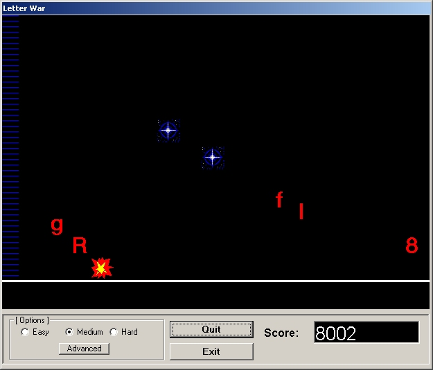



## Letter War

### Description

Letters and Numbers fall out of the sky. Type them before they hit the ground. Includes sound effects, difficulty selection and ability to modify the speed of the falling letters. Future enhancements include a High score list, and additional game time elements like Planes and helicopters. Feedback/Suggestions appreciated!
 
### More Info
 

             |
---                |---
**Submitted On**   |2002-08-30 11:39:16
**By**             |[E West](https://github.com/Planet-Source-Code/PSCIndex/blob/master/ByAuthor/e-west.md)
**Level**          |Intermediate
**User Rating**    |4.7 (14 globes from 3 users)
**Compatibility**  |VB 6\.0
**Category**       |[Games](https://github.com/Planet-Source-Code/PSCIndex/blob/master/ByCategory/games__1-38.md)
**World**          |[Visual Basic](https://github.com/Planet-Source-Code/PSCIndex/blob/master/ByWorld/visual-basic.md)
**Archive File**   |[Letter\_War1245618302002\.zip](https://github.com/Planet-Source-Code/e-west-letter-war__1-38498/archive/master.zip)

